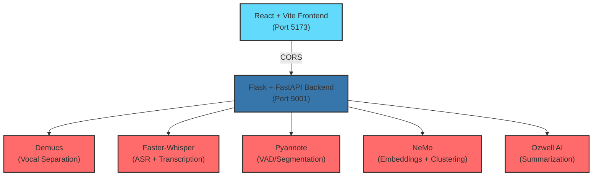
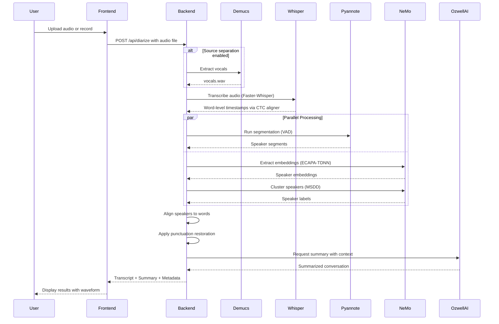

# GitHub Copilot Instructions for MIE Diarization

## Project Overview

**MIE_Diarization** is a speaker diarization and summarization system that combines state-of-the-art AI models for audio processing, transcription, and intelligent summarization. This project was developed as a summer internship project focused on advancing audio processing capabilities for medical and general use cases.

### What This Project Does

The system performs multi-stage audio processing:
1. **Audio Preprocessing**: Optional vocal extraction using Facebook's Demucs
2. **Transcription**: Speech-to-text using Faster-Whisper with word-level timestamps via CTC forced alignment
3. **Diarization**: Speaker identification using Pyannote segmentation (VAD) combined with NeMo's ECAPA-TDNN embeddings and MSDD clustering
4. **Post-processing**: Punctuation restoration and alignment refinement
5. **Summarization**: AI-powered conversation summaries via Ozwell AI with specialized prompts for medical and general contexts

### Architecture

The project consists of two main components:



### Technology Stack

#### Backend (Python)
- **Framework**: Flask + FastAPI hybrid architecture
- **Core ML Libraries**:
  - `faster-whisper` (>=1.1.0) - Fast Whisper implementation for transcription
  - `nemo_toolkit[asr]` (2.0.0rc0) - NVIDIA NeMo for diarization
  - `whisperX` - Extended Whisper functionality with alignment
  - `pyannote.audio` - Voice Activity Detection and segmentation
- **Audio Processing**:
  - `demucs` - Source separation (vocals extraction)
  - `librosa`, `soundfile`, `torchaudio` - Audio I/O and manipulation
  - `ffmpeg-python` - Audio format conversion
- **ML/AI**:
  - `torch`, `torchaudio` - PyTorch deep learning framework
  - `ctc-forced-aligner` - Word-level timestamp alignment
  - `deepmultilingualpunctuation` - Punctuation restoration
- **Utilities**:
  - `python-dotenv` - Environment variable management
  - `flask-cors` - Cross-Origin Resource Sharing
  - `nltk` - Natural language processing utilities

#### Frontend (JavaScript/React)
- **Framework**: React 19.1.0 with Vite 6.3.5
- **UI Components**:
  - Radix UI primitives (`@radix-ui/react-*`) - Accessible component primitives
  - Tailwind CSS 4.1.8 - Utility-first styling
  - Lucide React - Icon library
  - `class-variance-authority`, `clsx`, `tailwind-merge` - Styling utilities
- **Audio Features**:
  - `mic-recorder-to-mp3` - Browser-based audio recording
  - `wavesurfer.js` - Audio waveform visualization
- **Build Tools**:
  - Vite - Fast build tool and dev server
  - ESLint - Code linting and quality
  - PostCSS + Autoprefixer - CSS processing

#### Infrastructure
- **Containerization**: Docker (multi-stage builds for frontend + backend)
- **Orchestration**: Docker Compose for local and deployment environments
- **CI/CD**: GitHub Actions
  - Docker image publishing to Docker Hub
  - Proxmox container management for auto-deployment
- **Deployment**: Self-hosted on Proxmox infrastructure

### Project Structure

```
MIE_Diarization/
├── whisper-diarization/          # Backend Python application
│   ├── app.py                    # Flask API entry point
│   ├── diarize.py                # Main diarization pipeline
│   ├── diarize_parallel.py       # Parallel processing implementation
│   ├── helpers.py                # Utility functions for processing
│   ├── nemo_process.py           # NeMo-specific processing
│   ├── whisperx/                 # WhisperX module
│   │   ├── asr.py               # Automatic Speech Recognition
│   │   ├── diarize.py           # Diarization logic
│   │   ├── alignment.py         # Timestamp alignment
│   │   ├── audio.py             # Audio processing utilities
│   │   └── vads/                # Voice Activity Detection
│   ├── requirements.txt          # Python dependencies
│   ├── tests/                    # Backend tests
│   └── uploads/                  # Temporary audio file storage
│
├── diarization-ui/               # Frontend React application
│   ├── src/
│   │   ├── App.jsx              # Main application component
│   │   ├── main.jsx             # Entry point
│   │   ├── components/
│   │   │   └── ui/              # Reusable UI components
│   │   │       ├── AudioUploader.jsx
│   │   │       ├── MicRecorder.jsx
│   │   │       ├── Waveform.jsx
│   │   │       └── StatusBanner.jsx
│   │   └── assets/              # Static assets
│   ├── package.json             # Node dependencies
│   └── vite.config.js           # Vite configuration
│
├── .github/
│   ├── workflows/
│   │   ├── docker-publish.yml   # Docker image CI/CD
│   │   └── proxmox-deployment.yml # Deployment automation
│   └── copilot-instructions.md  # This file
│
├── Dockerfile                    # Multi-stage Docker build
├── docker-compose.yml            # Local development orchestration
├── docker-compose.deploy.yml    # Production deployment config
└── README.md                     # Project documentation
```

### Key Processing Pipeline



### Domain-Specific Features

#### Medical Mode
- Specialized prompt engineering for doctor-patient conversations
- Separate summaries for doctor and patient perspectives
- Medical terminology preservation
- HIPAA-conscious data handling (local processing)

#### General Mode
- Conversational summary generation
- Multi-speaker conversation support
- General-purpose transcription and summarization

## Code Quality Principles

### 🎯 DRY (Don't Repeat Yourself)
- **Never duplicate code**: If you find yourself copying code, extract it into a reusable function
- **Single source of truth**: Each piece of knowledge should have one authoritative representation
- **Refactor mercilessly**: When you see duplication, eliminate it immediately
- **Shared utilities**: Common job patterns should be abstracted into utility functions
- **Examples in this project**:
  - `helpers.py` contains reusable functions for audio processing, alignment, and output generation
  - UI components in `diarization-ui/src/components/ui/` are reusable across the application
  - Docker multi-stage builds share base configurations

### 💋 KISS (Keep It Simple, Stupid)
- **Simple solutions**: Prefer the simplest solution that works
- **Avoid over-engineering**: Don't add complexity for hypothetical future needs
- **Clear naming**: Functions and variables should be self-documenting
  - Good: `get_speaker_aware_transcript()`, `create_config()`, `handleFileChange()`
  - Bad: `process()`, `do_stuff()`, `x()`
- **Small functions**: Break down complex functions into smaller, focused ones
- **Readable code**: Code should be obvious to understand at first glance
- **Project examples**:
  - The diarization pipeline is broken into clear stages: preprocessing → transcription → diarization → alignment → summarization
  - Each Python module has a single, clear responsibility

### 🧹 Folder Philosophy
- **Clear purpose**: Every folder should have a main thing that anchors its contents
  - `whisper-diarization/`: All backend processing logic
  - `whisper-diarization/whisperx/`: WhisperX-specific implementations
  - `diarization-ui/src/components/ui/`: Reusable UI components
- **No junk drawers**: Don't leave loose files without context or explanation
  - Temporary files go in `uploads/` or `tmp/`
  - Configuration files are in project root or `.github/`
- **Explain relationships**: If it's not elegantly obvious how files fit together, add a README or note
- **Immediate clarity**: Opening a folder should make its organizing principle clear at a glance

### 🔄 Refactoring Guidelines
- **Continuous improvement**: Refactor as you work, not as a separate task
- **Safe refactoring**: Always run tests before and after refactoring
  - Backend: Run Python tests in `whisper-diarization/tests/`
  - Frontend: Run `npm run lint` before committing
- **Incremental changes**: Make small, safe changes rather than large rewrites
- **Preserve behavior**: Refactoring should not change external behavior
  - API endpoints must maintain backward compatibility
  - UI behavior should remain consistent for users
- **Code reviews**: All refactoring should be reviewed for correctness

### ⚰️ Dead Code Management
- **Immediate removal**: Delete unused code immediately when identified
- **Historical preservation**: Move significant dead code to `.attic/` directory with context
- **Documentation**: Include comments explaining why code was moved to attic
  ```python
  # Moved to .attic/ on 2025-10-25
  # Reason: Replaced by Faster-Whisper implementation
  # Original implementation was using OpenAI Whisper directly
  ```
- **Regular cleanup**: Review and clean attic directory periodically
- **No accumulation**: Don't let dead code accumulate in active codebase

## Accessibility (ARIA Labeling)

### 🎯 Interactive Elements
- **All interactive elements** (buttons, links, forms, dialogs) must include appropriate ARIA roles and labels
- **Use ARIA attributes**: Implement `aria-label`, `aria-labelledby`, and `aria-describedby` to provide clear, descriptive information for screen readers
  ```jsx
  // Good example
  <button
    onClick={handleUpload}
    aria-label="Upload audio file for diarization"
    className="upload-btn"
  >
    Upload Audio
  </button>
  
  // Bad example
  <button onClick={handleUpload}>Upload</button>
  ```
- **Semantic HTML**: Use semantic HTML wherever possible to enhance accessibility
  - Use `<button>` instead of `<div>` with click handlers
  - Use `<nav>`, `<main>`, `<header>`, `<footer>` for layout structure
  - Use `<label>` with form inputs

### 📢 Dynamic Content
- **Announce updates**: Ensure all dynamic content updates (modals, alerts, notifications) are announced to assistive technologies using `aria-live` regions
  ```jsx
  // Announce diarization progress
  <div aria-live="polite" aria-atomic="true">
    {processingStatus}
  </div>
  ```
- **Maintain tab order**: Maintain logical tab order and keyboard navigation for all features
  - Audio controls should be keyboard accessible
  - File upload should support keyboard activation
  - Recording controls must work with Space/Enter keys
- **Visible focus**: Provide visible focus indicators for all interactive elements
  - Use CSS `:focus-visible` for keyboard navigation
  - Ensure sufficient color contrast for focus states

### Audio-Specific Accessibility
- **Transcripts**: Always provide text transcripts of audio content (this is the core feature!)
- **Waveform alternatives**: Provide text alternatives for visual waveforms
- **Status announcements**: Announce recording state changes ("Recording started", "Recording stopped")
- **Error handling**: Clearly announce errors related to microphone access or file uploads

## Internationalization (I18N)

### 🌍 Text and Language Support
- **Externalize text**: All user-facing text must be externalized for translation
  ```jsx
  // Future implementation - prepare structure
  const strings = {
    uploadAudio: "Upload Audio File",
    recordAudio: "Record Audio",
    processing: "Processing..."
  };
  ```
- **Multiple languages**: Support multiple languages, including right-to-left (RTL) languages such as Arabic and Hebrew
  - The Whisper model already supports 90+ languages for transcription
  - UI text should be prepared for RTL layout
- **Language selector**: Provide a language selector for users to choose their preferred language
  - Backend: Language parameter for transcription model
  - Frontend: UI language preference

### 🕐 Localization
- **Format localization**: Ensure date, time, number, and currency formats are localized based on user settings
  - Timestamps in transcripts should respect locale
  - File sizes should use appropriate units for locale
- **UI compatibility**: Test UI layouts for text expansion and RTL compatibility
  - Buttons should accommodate longer translations (German, Finnish)
  - Layout should flip correctly for RTL languages
- **Unicode support**: Use Unicode throughout to support international character sets
  - Already implemented in Python (UTF-8 encoding)
  - Ensure React properly handles Unicode characters

### Audio Processing Considerations
- **Language detection**: Whisper includes automatic language detection
- **Multi-language support**: The system already supports transcription in multiple languages
- **Punctuation models**: Different punctuation models are available for different languages (see `punct_model_langs` in `helpers.py`)

## Documentation Preferences

### Diagrams and Visual Documentation
- **Always use Mermaid diagrams** instead of ASCII art for workflow diagrams, architecture diagrams, and flowcharts
  - Already implemented in main README.md (see sequence and flow diagrams)
- **Use memorable names** instead of single letters in diagrams (e.g., `Frontend`, `Backend`, `Whisper` instead of `A`, `B`, `C`)
- Use appropriate Mermaid diagram types:
  - `graph TB` or `graph LR` for workflow architectures
  - `flowchart TD` for process flows
  - `sequenceDiagram` for API interactions (see pipeline documentation)
  - `gitgraph` for branch/release strategies
- Include styling with `classDef` for better visual hierarchy
  ```mermaid
  classDef frontend fill:#61dafb,stroke:#333,stroke-width:2px
  classDef backend fill:#3776ab,stroke:#333,stroke-width:2px
  class Frontend frontend
  class Backend backend
  ```
- Add descriptive comments and emojis sparingly for clarity (as seen in this file)

### Documentation Standards
- **Keep documentation DRY**: Reference other docs instead of duplicating
  - Main README.md contains the comprehensive project overview
  - Component-specific READMEs should reference the main README
  - This file references architectural decisions from README.md
- **Use clear cross-references**: Link related documentation files
  - Reference deployment docs in Docker configuration
  - Link to model-specific documentation for NeMo, Whisper, Pyannote
- **Update architecture docs**: When workflow structure changes, update both code and diagrams
  - Keep sequence diagrams in sync with actual pipeline implementation
  - Update technology stack section when dependencies change

## Working with GitHub Actions Workflows

### Development Philosophy
- **Script-first approach**: All workflows should call scripts that can be run locally
  - Currently, workflows directly use Docker commands
  - Future improvement: Extract to shell scripts in `scripts/` directory
- **Local development parity**: Developers should be able to run the exact same commands locally as CI runs
  ```bash
  # Developers should be able to run:
  docker-compose up --build
  # Just like CI does
  ```
- **Simple workflows**: GitHub Actions should be thin wrappers around scripts, not contain complex logic
  - Current workflows are already quite simple (good!)
  - Maintain this simplicity as workflows evolve
- **Easy debugging**: When CI fails, developers can reproduce the issue locally by running the same script

### Current Workflows

#### Docker Publish Workflow (`.github/workflows/docker-publish.yml`)
- Builds and publishes frontend and backend Docker images
- Triggers on push to `main` branch or version tags
- Multi-architecture support (amd64, arm64)
- Uses GitHub Actions cache for faster builds

#### Proxmox Deployment Workflow (`.github/workflows/proxmox-deployment.yml`)
- Automated deployment to Proxmox infrastructure
- Uses self-hosted runners
- Manages multi-component deployment (Python backend + Node.js frontend)
- Runs `docker-compose.deploy.yml` for production

### Best Practices
- Keep secrets in GitHub Secrets (never commit credentials)
- Use specific action versions (`@v4`, not `@latest`)
- Always include meaningful job names and step descriptions
- Cache dependencies when possible (Docker layer caching, npm cache)

## Development Guidelines

### Backend Development (Python)

#### Environment Setup
```bash
cd whisper-diarization
pip install -c constraints.txt -r requirements.txt
```

#### Environment Variables
Required in `.env` file:
- `HF_TOKEN` - Hugging Face API token for Pyannote models
- `OZWELL_API_KEY` - Ozwell AI API key for summarization

#### Running Backend Locally
```bash
python app.py  # Starts Flask server on port 5001
```

#### Code Style
- Follow PEP 8 style guidelines
- Use type hints where appropriate
- Add docstrings for complex functions
- Keep functions focused and single-purpose

#### Testing
- Add tests in `whisper-diarization/tests/`
- Test audio processing with sample files
- Mock external API calls (Ozwell AI)

### Frontend Development (React)

#### Environment Setup
```bash
cd diarization-ui
npm install --legacy-peer-deps
```

#### Running Frontend Locally
```bash
npm run dev  # Starts Vite dev server on port 5173
```

#### Code Style
- Use functional components with hooks
- Follow React best practices
- Use Tailwind CSS for styling
- Keep components small and focused
- Add PropTypes or TypeScript for type safety (future improvement)

#### Linting
```bash
npm run lint  # Run ESLint
```

### Docker Development

#### Build and Run Everything
```bash
# Development
docker-compose up --build

# Production
docker-compose -f docker-compose.deploy.yml up --build
```

#### Individual Services
```bash
# Build frontend only
docker build --target frontend -t mie-frontend .

# Build backend only
docker build --target backend -t mie-backend .
```

## API Documentation

### Backend Endpoints

#### Health Check
```
GET /api/test
Response: {"message": "Backend is running!"}
```

#### Diarization
```
POST /api/diarize
Content-Type: multipart/form-data

Form Data:
- audio: Audio file (WebM, MP3, WAV, etc.)
- interaction_type: "medical" or "general" (default: "medical")

Response: {
  "transcript": "Full diarized transcript",
  "summary": "AI-generated summary",
  "speakers": ["SPEAKER_00", "SPEAKER_01", ...],
  "segments": [...],
  "metadata": {...}
}
```

## Known Limitations and Future Work

### Current Limitations
- **Overlapping speakers**: Not yet fully addressed
  - Possible solution: Audio source separation per speaker before processing
- **Resource constraints**: Processing requires significant RAM and CPU
  - Hosted version limited to ~1 minute audio files
- **Hallucination risk**: AI summarization may occasionally produce inaccuracies
  - Mitigated through prompt engineering

### Future Improvements
- Enhanced overlapping speaker support
- Real-time streaming transcription
- Additional summarization modes (legal, educational, etc.)
- WebSocket support for progress updates
- Batch processing for multiple files
- Speaker identification/recognition (beyond diarization)

## Quick Reference

### Code Quality Checklist
Before committing code, verify:
- [ ] **DRY**: No code duplication - extracted reusable functions?
- [ ] **KISS**: Simplest solution that works?
- [ ] **Naming**: Self-documenting function/variable names?
- [ ] **Size**: Functions small and focused?
- [ ] **Dead Code**: Removed or archived appropriately?
- [ ] **Accessibility**: ARIA labels and semantic HTML implemented?
- [ ] **I18N**: User-facing text externalized for translation?

### Before Committing

#### Backend (Python)
1. Run tests: `python -m pytest whisper-diarization/tests/` (if tests exist)
2. Check for unused imports: Review and remove
3. Verify DRY: Look for duplicated logic
4. Simplify: Can any function be made simpler?
5. Archive/Delete: Handle any dead code appropriately
6. Check environment variables: Are secrets properly loaded from `.env`?

#### Frontend (React)
1. Run linter: `npm run lint`
2. Check for unused components: Review imports
3. Verify DRY: Look for duplicated JSX or logic
4. Simplify: Can components be broken down further?
5. Archive/Delete: Remove unused UI components
6. Accessibility: Check ARIA labels and keyboard navigation
   - Test with keyboard only (Tab, Enter, Space)
   - Verify focus indicators are visible
7. I18N: Verify text externalization and RTL compatibility

#### Docker
1. Build successfully: `docker-compose build`
2. Run locally: `docker-compose up`
3. Test both services communicate via CORS
4. Check image sizes aren't unnecessarily large
5. Verify `.dockerignore` excludes unnecessary files

### Common Commands

```bash
# Backend
cd whisper-diarization
python app.py                    # Start Flask server
python diarize.py -a <audio>     # Run diarization standalone

# Frontend
cd diarization-ui
npm run dev                      # Start dev server
npm run build                    # Production build
npm run lint                     # Run linter

# Docker
docker-compose up --build        # Build and run all services
docker-compose down              # Stop all services
docker-compose logs -f backend   # View backend logs
docker-compose logs -f frontend  # View frontend logs

# Git
git status                       # Check changes
git add .                        # Stage all changes
git commit -m "message"          # Commit changes
git push origin <branch>         # Push to remote
```

## Additional Resources

### Model Documentation
- [Faster-Whisper](https://github.com/guillaumekln/faster-whisper) - Fast Whisper implementation
- [NVIDIA NeMo](https://github.com/NVIDIA/NeMo) - Neural modules for speech AI
- [Pyannote Audio](https://github.com/pyannote/pyannote-audio) - Speaker diarization toolkit
- [Facebook Demucs](https://github.com/facebookresearch/demucs) - Music source separation

### Project Videos
- [Full Project Overview](https://youtube.com/shorts/aS2HU26QRXU?si=piUQbxEMDIeN3q_)
- [Pipeline Sequence Diagram Explained](https://youtu.be/2UFZsiDDGJg?si=Y6SaWHJaM2THGdCh)
- [Whisper Model Comparison](https://youtube.com/shorts/H21NiwoXnQg?si=Sqt_Jc2ZTt-Qgu5x)

### External Repositories
- [Original WhisperX Diarization](https://github.com/MahmoudAshraf97/whisper-diarization) - Base project this work extends

---

**Remember**: This project processes sensitive audio data. Always handle user data responsibly, maintain privacy, and follow best practices for secure data handling. The system is designed to process locally, minimizing data exposure.
MIE_Diarization is a full-stack audio diarization and summarization project that combines:
- **Backend**: Python (Flask + FastAPI) for audio processing, transcription, and diarization
- **Frontend**: React + Vite with Tailwind CSS and Shadcn UI components
- **Core Technologies**: Pyannote, NeMo, Faster-Whisper, Demucs, CTC Forced Aligner

The system processes audio files to identify speakers (diarization), transcribe speech, and generate intelligent summaries using Ozwell AI.

## Architecture

### Backend (`/whisper-diarization`)
- **Language**: Python 3.11
- **Framework**: Flask with CORS enabled
- **Main Components**:
  - `app.py`: Flask API server with endpoints for diarization and summarization
  - `diarize.py`: Main diarization pipeline orchestration
  - `diarize_parallel.py`: Parallel processing implementation
  - `nemo_process.py`: NeMo speaker embedding and clustering
  - `helpers.py`: Utility functions for text processing and alignment
- **Key Dependencies**: faster-whisper, nemo_toolkit, pyannote, demucs, flask-cors

### Frontend (`/diarization-ui`)
- **Language**: JavaScript (ES2020+)
- **Framework**: React 19 with Vite
- **Styling**: Tailwind CSS 4.x + Shadcn UI components
- **Key Features**: Audio upload, real-time recording, waveform visualization (WaveSurfer.js)

### Processing Pipeline
1. **Audio Input** → Demucs (source separation for vocals)
2. **Transcription** → Faster-Whisper (ASR) → CTC Forced Aligner (word-level timestamps)
3. **Diarization** → Pyannote (VAD/segmentation) → NeMo (speaker embeddings + clustering)
4. **Post-processing** → Speaker-to-word mapping → Punctuation restoration
5. **Summarization** → Ozwell AI API (medical or general summaries)

## Development Setup

### Prerequisites
- Docker and Docker Compose
- Python 3.11+ (for local backend development)
- Node.js 20+ (for local frontend development)
- NVIDIA GPU with CUDA support (recommended for faster processing)

### Running with Docker (Recommended)
```bash
# Build and start both frontend and backend
docker-compose up --build

# Frontend: http://localhost:5173
# Backend: http://localhost:5001
```

### Local Backend Development
```bash
cd whisper-diarization
pip install -r requirements.txt -c constraints.txt
python app.py  # Runs on port 5001
```

### Local Frontend Development
```bash
cd diarization-ui
npm install --legacy-peer-deps
npm run dev  # Runs on port 5173
```

### Environment Variables
Create `.env` files in respective directories:
- `whisper-diarization/.env`: `HF_TOKEN` (Hugging Face), `OZWELL_API_KEY`
- Frontend connects to backend at `http://localhost:5001` by default

## Coding Standards

### Python Backend
- **Style**: Follow PEP 8 conventions
- **Imports**: Standard library → Third-party → Local imports
- **Error Handling**: Use try-except blocks with specific exceptions
- **Logging**: Use Python's `logging` module (already configured in diarize.py)
- **File Paths**: Use `os.path.join()` for cross-platform compatibility
- **API Responses**: Return JSON with appropriate HTTP status codes

### JavaScript Frontend
- **Style**: ESLint configuration in `eslint.config.js`
- **Components**: Functional components with hooks
- **Naming**: PascalCase for components, camelCase for functions/variables
- **Imports**: React imports → Third-party → Local components/utils
- **CSS**: Use Tailwind utility classes; custom styles in `.css` files when needed

## Key Components and Files

### Backend Critical Files
- `app.py`: Flask API endpoints (`/api/test`, `/api/diarize`)
- `diarize.py`: Main diarization script with CLI arguments
- `nemo_process.py`: Speaker embedding extraction and clustering
- `helpers.py`: Text processing, alignment, SRT generation utilities
- `requirements.txt`: Python dependencies (locked versions in constraints.txt)

### Frontend Critical Files
- `src/App.jsx`: Main React application component
- `src/components/`: Reusable UI components (Shadcn UI based)
- `vite.config.js`: Vite build configuration
- `eslint.config.js`: Linting rules

### Configuration Files
- `docker-compose.yml`: Local development multi-container setup
- `docker-compose.deploy.yml`: Production deployment configuration
- `Dockerfile`: Multi-stage build (frontend + backend)
- `nemo_msdd_configs/`: NeMo diarization model configurations

## Testing and Quality

### Backend Testing
- Test assets located in `whisper-diarization/tests/assets/`
- Run diarization manually: `python diarize.py -a <audio_file>`
- Test API endpoints: `curl http://localhost:5001/api/test`

### Frontend Testing
- Linting: `npm run lint` (in diarization-ui/)
- ESLint enforces React hooks rules and unused variable checks
- Manual testing via browser at http://localhost:5173

### Code Quality Tools
- **Python**: Follow existing patterns in codebase (no automated linter configured)
- **JavaScript**: ESLint with React hooks and refresh plugins

## Build and Deployment

### Docker Build
```bash
# Build individual stages
docker build --target backend -t mie-backend .
docker build --target frontend -t mie-frontend .

# Or use docker-compose
docker-compose build
```

### Frontend Build
```bash
cd diarization-ui
npm run build  # Outputs to dist/
npm run preview  # Preview production build
```

### Deployment
- Uses `docker-compose.deploy.yml` for production
- GitHub Actions workflows: `docker-publish.yml`, `proxmox-deployment.yml`
- Hosted on server with limited resources (4GB RAM, 4 CPU cores)

## Important Notes

### Performance Considerations
- Audio processing is resource-intensive (requires GPU for optimal performance)
- Long audio files (>1 minute) require significant memory and CPU
- Use `--batch-size` parameter to control memory usage
- Consider `--no-stem` flag for long files without music

### Known Limitations
- Overlapping speakers not fully supported
- Hosted version limited to ~1 minute audio due to resource constraints
- Model hallucinations possible during summarization

### Dependencies to Watch
- `nemo_toolkit[asr]==2.0.0rc0`: Release candidate, may have breaking changes
- `faster-whisper>=1.1.0`: Core transcription engine
- Git-based dependencies: demucs, deepmultilingualpunctuation, ctc-forced-aligner
- Frontend: React 19 (latest), Tailwind CSS 4.x

## API Endpoints

### Backend Routes
- `GET /api/test`: Health check endpoint
- `POST /api/diarize`: Main diarization endpoint
  - Accepts: `multipart/form-data` with `audio` file and `interaction_type` field
  - Returns: JSON with transcript and summary

### CORS Configuration
- Backend allows requests from `http://localhost:5173` (frontend dev server)
- Update `app.py` CORS settings for different origins

## Workflow Integration

### CI/CD Pipelines
- **docker-publish.yml**: Builds and publishes Docker images
- **proxmox-deployment.yml**: Automated deployment to Proxmox server

## Tips for Contributors

1. **Audio Processing**: Understand the pipeline flow (see mermaid diagrams in README.md)
2. **Model Downloads**: First run downloads large models (Whisper, NeMo, Pyannote)
3. **Token Requirements**: HuggingFace token needed for Pyannote models
4. **Frontend State**: React components manage audio recording and file upload states
5. **Error Handling**: Check Flask logs and browser console for debugging
6. **File Outputs**: Generated files (.txt, .srt) saved in `whisper-diarization/uploads/`

## Common Tasks

### Adding New API Endpoints
1. Define route in `app.py` with appropriate HTTP method
2. Add CORS configuration if needed
3. Return JSON responses with proper error handling

### Adding UI Components
1. Use Shadcn UI components from `src/components/`
2. Follow existing patterns in `App.jsx`
3. Apply Tailwind classes for styling
4. Run `npm run lint` to check code quality

### Modifying Diarization Pipeline
1. Core logic in `diarize.py` with argparse configuration
2. Helper functions in `helpers.py`
3. NeMo-specific processing in `nemo_process.py`
4. Test with sample audio files in `whisper-diarization/tests/assets/`

## Getting Help

- **Documentation**: See README.md in root and subdirectories
- **Issues**: Repository issues for bug reports and feature requests
- **Videos**: Project overview and pipeline explanations linked in main README.md
- **Base Project**: Original diarization work from https://github.com/MahmoudAshraf97/whisper-diarization
