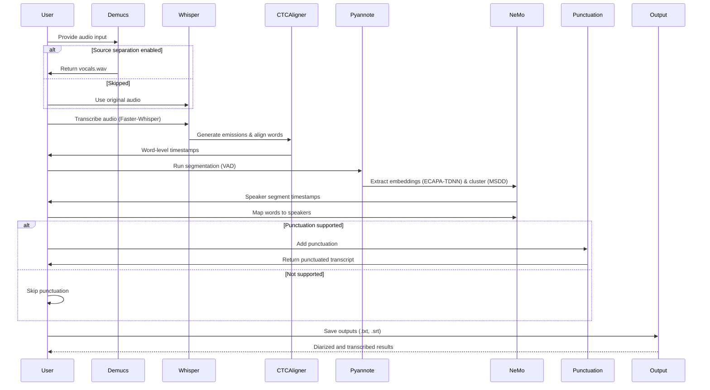
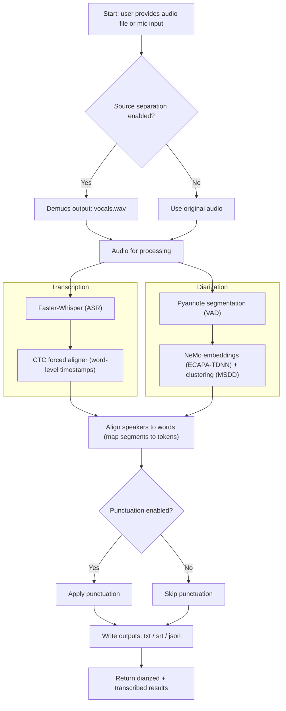

# MIE_Diarization
This is a diarization + transcription project that uses Pyannote for VAD/segmentation, NeMo (ECAPA-TDNN + MSDD) for speaker embedding/clustering, and Faster-Whisper for ASR.

It supports two processing modes:
- **Diarization + Transcription** (`mode=full`)
- **Transcription Only** (`mode=asr`)

This project is my summer internship work, which I've worked on as sole member.

Below are some shorts/videos about the project and my research:
## 🎬 Project Shorts

| 🎥 Topic                                                  | 🔗 Watch                                                                 |
|-----------------------------------------------------------|--------------------------------------------------------------------------|
| 📊 **Full Project Overview**                              | [Watch on YouTube](https://youtube.com/shorts/aS2HU26QRXU?si=piUQbxEMDIeN3q_) |
| 📈 **Pipeline Sequence Diagram Explained**                | [Watch on YouTube](https://youtu.be/2UFZsiDDGJg?si=Y6SaWHJaM2THGdCh)           |
| 🤖 **Whisper Model Comparison & Faster-Whisper Insights** | [Watch on YouTube](https://youtube.com/shorts/H21NiwoXnQg?si=Sqt_Jc2ZTt-Qgu5x) |


Below is the description for running the diarization pipeline. This work couldn't have been possible without the project of diarization from https://github.com/MahmoudAshraf97/whisper-diarization

<h1 align="center">Speaker Diarization using NEMO + Pyannote Pipeline using OPEN AI Whisper</h1>

 **Please, star the project on github (see top-right corner) if you appreciate my contribution to the community!**

## What is it
This repository combines Faster-Whisper ASR capabilities with Pyannote's segmentation model for Voice Activity Detection (VAD) and initial segmentation, and NeMo components including ECAPA-TDNN and MSDD for speaker embeddings and clustering to identify the speaker for each sentence in the transcription generated by Faster-Whisper. First, the vocals are extracted from the audio to increase the speaker embedding accuracy, then the transcription is generated using Faster-Whisper, and the timestamps are corrected and aligned using **ctc-forced-aligner** to help minimize diarization error due to time shift. The audio is then passed into Pyannote's segmentation model for VAD and segmentation to exclude silences, and NeMo's ECAPA-TDNN and MSDD components are then used to extract speaker embeddings and cluster speakers to identify the speaker for each segment. The result is associated with the timestamps generated by **ctc-forced-aligner** to detect the speaker for each word based on timestamps and then realigned using punctuation models to compensate for minor time shifts.

The output is displayed to the user in the **frontend**, which is built with **React + Vite** and communicates with the backend (**Flask**) over **CORS**.


## API
- `POST /api/diarize`
    - `multipart/form-data`: `audio` (file), `mode` (`full` or `asr`)
    - Returns: `transcript` (text) and `diarization_json` (when available)

## Speaker Enrollment & Known Speaker Identification

This project now supports **known speaker enrollment and identification** on top of standard diarization.

The workflow is split into two phases:

### 1. Speaker Enrollment
A speaker can be enrolled once using a clean reference audio sample. During enrollment, the system:
- Runs VAD to remove silence
- Extracts **NeMo speaker embeddings (192-dim, Titanet-based)**
- Stores the averaged embedding in a persistent JSON database

Example:
```bash
python3 diarize.py \
  --enroll-speaker \
  --speaker-audio "Speaker Audios/Ayush.mp3" \
  --speaker-label "Ayush" \
  --speakers-db "Speaker Audios/speakers_db.json"
```

This creates or updates `speakers_db.json` with the enrolled speaker embedding.

### 2. Known Speaker Identification during Diarization
Once speakers are enrolled, diarization can identify who is speaking by comparing cluster embeddings against the enrolled database.

Example:
```bash
python3 diarize.py \
  -a "ayushandamber.mp3" \
  --mode full \
  --identify-known \
  --candidate-labels "Ayush,Amber"
```

Internally, the pipeline:
- Runs full diarization (Pyannote + NeMo MSDD)
- Aggregates audio per diarized cluster
- Computes **NeMo speaker embeddings per cluster**
- Matches clusters to enrolled speakers using cosine similarity
- Assigns speaker identities when similarity crosses a threshold

If `--candidate-labels` is provided, matching is restricted to those speakers only.

## Running the Full Project Locally (Docker)

This repo ships with a **React frontend** and a **Python backend (Flask)**. The two services communicate over **CORS**.  
To run the **entire stack locally using Docker**, use the provided `docker-compose.yml`, which creates **two containers** (frontend + backend).

> Prerequisites: Docker & Docker Compose installed.

```bash
# From the repository root

# Option A: build then run
docker-compose build
docker-compose up

# Option B: one-shot build+run
docker-compose up --build
```
This will spin up two containers on your local system:
      
    Backend: Flask (handles diarization and transcription requests).
      
    Frontend: React + Vite interface for uploading audio, running diarization, and viewing results.

Once running, you can access the UI at http://localhost:5173 (default Vite port), which will interact with the backend automatically.

## Hosted Website

If you don’t want to run it locally, you can try the hosted version here:
🔗 MIE Diarization Website

⚠️ Note: The open-source MIE server only has 4 GB RAM and 4 CPU cores, so it cannot handle audio files longer than ~1 minute due to the heavy models involved. For full-length audio support, it’s recommended to run the project on your own system using the docker-compose.yml file.

## Known Limitations
- Overlapping speakers are yet to be addressed, a possible approach would be to separate the audio file and isolate only one speaker, then feed it into the pipeline but this will need much more computation
- There might be some errors, please raise an issue if you encounter any.
- Diarization/transcription quality can vary depending on audio quality and speaker overlap.

## Future Improvements
- Improve overlapping of the audio

## Acknowledgements
This work is based on [OpenAI's Whisper](https://github.com/openai/whisper) , [Faster Whisper](https://github.com/guillaumekln/faster-whisper) , [Nvidia NeMo](https://github.com/NVIDIA/NeMo) , [Facebook's Demucs](https://github.com/facebookresearch/demucs), and [Pyannote](https://github.com/pyannote/pyannote-audio) for segmentation.


This is how the flow is:
## 🔄 Diarization + Transcription Pipeline (Sequence Diagram)



---

## 🔄 Diarization + Transcription Pipeline (Flow Diagram)


